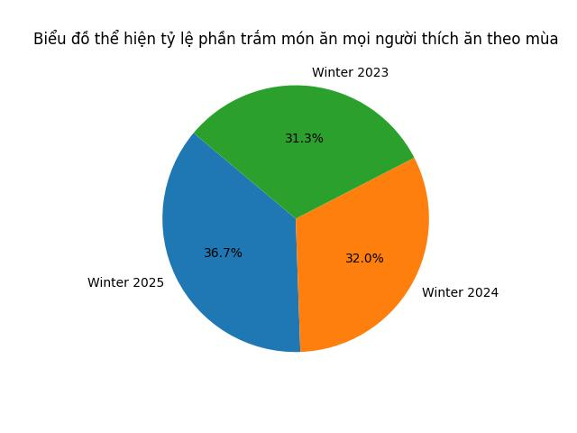
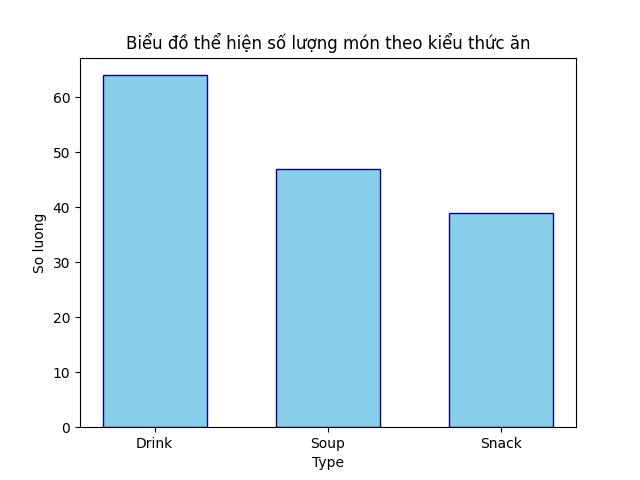
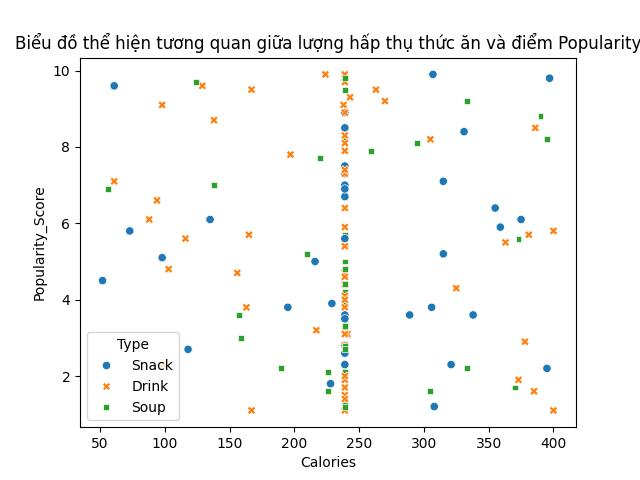

# Data Analyst Personal Portfolio Project

## Tổng quan dự án (Project Overview)
Dự án này bao gồm hai phân tích dữ liệu chính nhằm chứng minh kỹ năng xử lý dữ liệu đa dạng:
1.  **Phân tích hành vi ẩm thực mùa đông:** Sử dụng **Python (Pandas, Matplotlib, Seaborn)** để khám phá xu hướng ăn uống qua các năm.
2.  **Dashboard Quản trị Logistics:** Sử dụng **Power BI** để tối ưu hóa theo dõi vận hành, doanh thu và vận chuyển.

---

## Công cụ sử dụng (Tech Stack)
* **Ngôn ngữ:** Python (Phân tích & Trực quan hóa)
* **Công cụ BI:** Power BI
* **Thư viện Python:** Pandas, Matplotlib, Seaborn
* **Kỹ năng:** Đọc hiểu biểu đồ, Xử lý dữ liệu (Cleaning), Phân tích tương quan.

---

## Phần 1: Phân tích Ẩm thực Mùa đông (Python Analysis)

Phần này tập trung vào việc tìm hiểu thói quen ăn uống của người dùng trong giai đoạn mùa đông từ năm 2023 đến 2025.

### 1. Cơ cấu món ăn theo mùa
Biểu đồ tròn cho thấy sự tăng trưởng dần đều về sự quan tâm của người dùng đối với các món ăn mùa đông qua từng năm, đạt đỉnh vào năm 2025 với **36.7%**.

 

### 2. Phân loại thực phẩm (Food Categories)
Qua biểu đồ cột, chúng ta thấy **Đồ uống (Drink)** chiếm số lượng áp đảo (hơn 60 món), theo sau là Soup và Snack. Điều này cho thấy nhu cầu giữ ấm cơ thể bằng đồ uống nóng trong mùa đông là rất lớn.

### 3. Tương quan giữa Calo và Độ phổ biến
Biểu đồ phân tán (Scatter Plot) cho thấy sự phân bổ đa dạng. Đặc biệt, có một cụm dữ liệu tập trung mạnh ở mức **240 Calories**, nơi mà cả Drink, Snack và Soup đều có điểm Popularity trải dài từ thấp đến cao.

---
